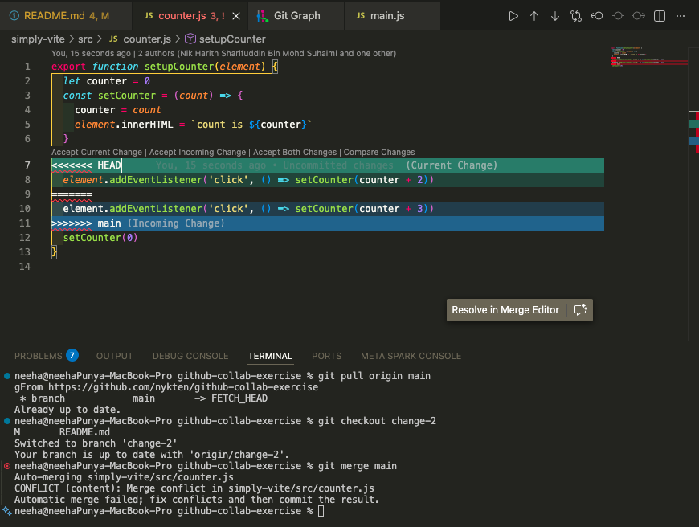
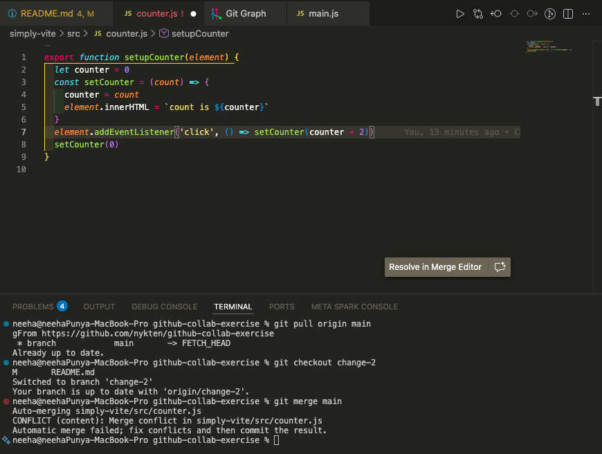
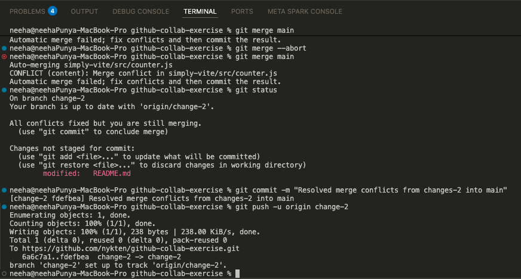

# Github Collaboration Exercise

How to collab in Github, using merge strats and CI/CD workflows

## Purpose

This repo is for myself (and hopefully for others) to experiment and learn how collaboration is to be carried out using Github. This exploration includes:

1. How to adopt merge strategies when making changes. Some strats are explained below.
2. Using CI/CD + testing workflows with Github Actions. This is something known, but new for me.

### Why?

Because I've been confused and have yet to receive any formal mentoring/guide on how to do these stuffs. I do however, remember how things were done in my past **team project** back in university and that was hands down the best experience working properly in a team setting. 

Even though I was actively participating, I missed out some parts especially when formulating CI/CD workflows for our repo back then, so here I am trying to do it by myself. Also we used GitLab back then and not Github but honestly, just different tools different terminologies and workflows.

### What I've already known so far

I know about *some* branching/merging strategies as wll as basic understading of what CI/CD is.

1. I know what a merge request (pull request) is.
2. I know how to merge branches and solve conflicts.
3. I know how to open an issue, but in Github, a branch will not be made automatically upon opening it unlike GitLab (where you can can also customise the name format of your branch).
4. I know how make feature branches and the feature branching strategy.
5. I understand how approving pull requests work.
6. I understand how CI/CD pipeline works in general. I don't know how to set it up just yet.

As such, I want to try emulate the kind of workflow I did back when I had my amazing team project. I loved the proper, clean and collaborative workflow we had back then and want to come up with a personal 'cookbook' or 'wiki' on how to start it or just understand it whenever I join another project/team.

As I progress through doing stuffs in this repo, I will update this README on the go.

## Proposed tech stack

I'm planning to use **Vite** with vanilla JS as my basic tech stack. A frontend web dev should be enough.

Why Vite? I simply want to test the CI/CD and testing workflows on something with node.js. Could've used something else like Java or C\# which I'm more familiar with but I want to keep it as simple as possible... hopefully..

## Test #1 - Opening an issue

Opened an issue [here](https://github.com/nykten/github-collab-exercise/issues/1) with tagging and assigning myself as the assignee. Simple enough. Maybe lack direction but that's how it's simply done.

You apparently can't tie an issue with a branch (or create one) within the issue page unlike GitLab.

Based on observation on other repos including OSS repos, most people describe their 'issues' with any improvements/bugs/feature request that could be added to the repo, then just create a branch themselves. Then, they would push their commits to the remote repo while opening a pull request. This way, they can also 'link' or more precisely *'add reference'* of the issue to the pull request.

Example seen in: [This pull request](https://github.com/firebase/functions-samples/pull/1214).
They mentioned the issue in the pull request as *"Fixes #[issue-number]"*

### Workflow differences (GitLab vs Github)

#### GitLab:

1. Open an issue.
2. Can select the option to automatically create a new branch with the issue name.
3. Make changes and commit to the branch created.
4. Push to remote repo.
5. Make a merge request (PR).
6. Solve merge conflicts if any,
7. Merge request clears CI/CD pipeline & approvals.
8. Merge to main/master.

#### Github:

1. Open an issue describing the issue/new feature.
2. Make a new branch manually (locally/remotely).
3. Make changes, commit & push to the branch.
4. Make a pull request.
5. Solve merge conflicts if any.
6. Pull request clears CI/CD pipeline & approvals.
7. Merge to main/master.

### Takeaway

So the only difference in the workflows would be the automation of creating a branch upon an issue creation in GitLab while Github doesn't have that. Although I think it might be possible with some integrations.

Not much of an issue or confusion, just that I like the workflow on GitLab better.

## Test 2: Resolving Pull Requests

Here's what I did:

1. Created a branch `change-1` on Github (remote).
2. Pulled the new branch to local.
3. Commit some changes.
4. Push to branch `change-1`.
5. View the branch page which has the `Compare & pull request` prompt at the top
6. Made a pull request by clicking on the prompt.
7. Fill in the description with what had changed, mentioning which issue related to it by typing '#', a prompt will appear where you can select which issue (in this case number 1).
8. Github did some checkings, *'Safe to merge'*.
9. Merged the pull request to branch `main`.
10. Closed the issue #1.

Obviously this is a one-man job so no actual reviews happened, but it would have been taken place between step 7~8.

## Test 3: Starting from local branch

Command to create new branch locally & go into it:
> `git branch <branchName>`
> `git switch <branchName>`

Make changes & commit like usual

To push to remote from local (making it available in Github):
> `git push --set-upstream origin <branchName>`

## Test 4: Resolving Merge conflicts

I deliberately made a change in the `main` branch so that it will affect the same file in `change-2`, producing a conflict I later need to resolve.

How do you resolve it?

### Resolve using Github

In the pull request, there will be an option for us to explore the conflict and resolve it using their **web editor**.

When we click it, it will open up this:

From here we can accept/reject the changes we want, or just edit the file to produce the desired output. More information on how this works here: [Official Github Docs](https://docs.github.com/en/pull-requests/collaborating-with-pull-requests/addressing-merge-conflicts/resolving-a-merge-conflict-using-the-command-line)

### Resolve using command line

I did it in my terminal in VSCode.

Github does outline the basic command on how below:

But they don't tell you how to actually resolve it in that same card. It will redirect you to [here](https://docs.github.com/en/pull-requests/collaborating-with-pull-requests/addressing-merge-conflicts/resolving-a-merge-conflict-using-the-command-line) (which is the previous link above).

When doing merge through command line/terminal, VSCode will open the conflicted file and it will have the same format as the web editor, where we will then need to accept/reject the changes we want.

And since for this conflict, the change we want to make is from the *Current change* in our current branch `change-2`, we accept that over the *Incoming change* from the `main` branch. The result would be:

### Resolve in VSCode with 'Merge Editor'

Alternatively, VSCode offers a way to resolve merge conflicts by opening up comparison 'windows' between the two branches and a result 'window'. 

When we first enter this view, the result window will show the *'base'* result which is the state of the file *before* changes from **INCOMING** and **CURRENT**.

Again in this situation, we want to accept the *Current changes* so we go ahead and click *'Accept Current'* in the top-right window. The final result will be outputted on the bottom window, showing that the counter will be **incremented by 2 (+2)** instead of 3 (the conflict we want to get rid of).

When we're happy with the result, we finish up by clicking 'Complete Merge' at the bottom left.

### Committing & concluding the merge conflict resolution

In order for the merge conflict to be fully 'resolved', we need to commit our changes. Simply commit with a helpful message and push it to the current branch, no need to `git add` anything.

> `git commit -m "Resolve merge conflict for this branch"`
> `git push origin change-2`

Now we can go back to our pull request to finally merge into main. But instead of merging normally into main, I made a new scenario where squash my commits + merge it into main.

### Recap on how to resolve merge conflicts:

Assuming you have your workflow in VSCode. The web editor on Github is doable too if the conflict is not too complex.

1. Pull from main (git pull)
2. Switch to the `otherBranch` (git switch)
3. Run: `git merge main` (Merging the conflicting stuffs from main into the `otherBranch`)
4. Resolve merge conflicts by accepting the desired change.
5. Commit the change (`git commit -m "resolve..."`)
6. Push to remote (make sure you're in the `otherBranch`)
7. Now we can proceed with merging into main via PR ✅
